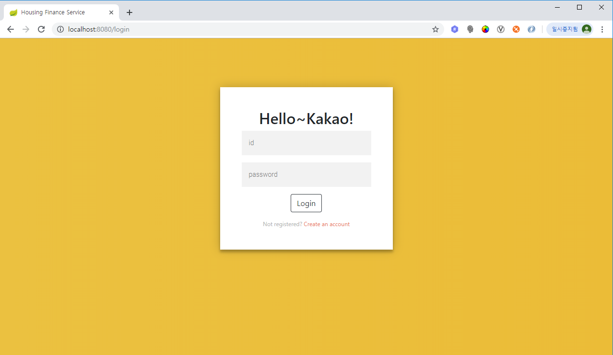
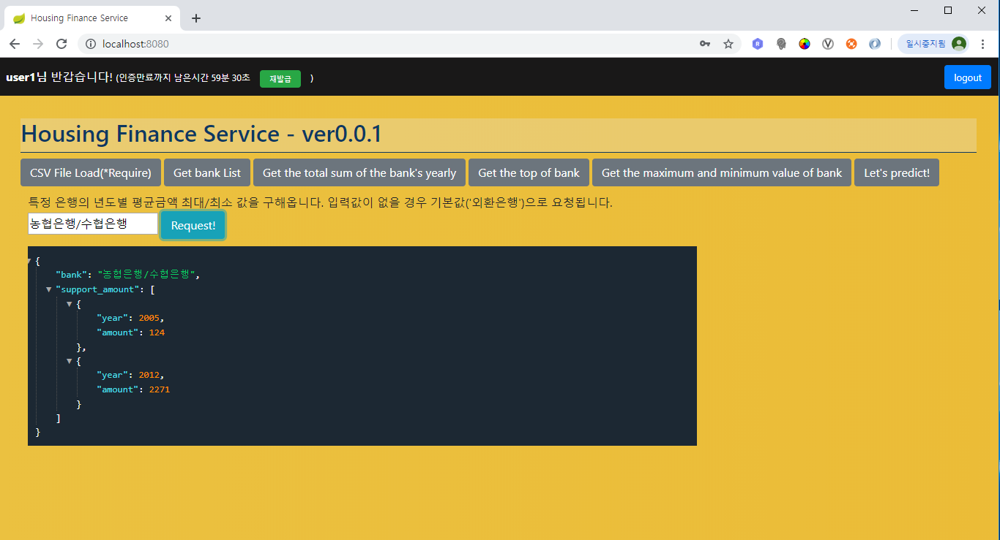

# housing-finance-webapp

### How to run

1. download runnable jar file : [jar download](https://github.com/HwangDahye/housing-finance-webapp/raw/master/out/housing-finance-webapp-0.0.1.jar)
2. run script on terminal  ```java -jar housing-finance-webapp-0.0.1.jar```
3. access [http://localhost:8080](http://localhost:8080)

**Sample Accounts**
- user1 / test
- user2 / test
- user3 / test
- user4 / test

### Api document (Postman)  
[Api document open on postman web](https://documenter.getpostman.com/view/8237099/SVtN3Wzx)

### Preview  
    
### Framework  
Spring Boot(jpa, security, web, freemarker)  
### Library 
|Project name|Version|Purpose|Link|
|:-----------|:------|:------|:---|
|Lombok|-|Automatically set getter,setter and constructor|[Link](https://projectlombok.org)|
|Jjwt|0.9.1|JSON Web Token|[Link](https://github.com/jwtk/jjwt)|


### File Structure  
```
HOUSING-FINANCE-WEBAPP
|   pom.xml
|   README.md
+---src
    +---main
    |   +---java
    |   |   \---com
    |   |       \---hdh
    |   |           \---housingfinancewebapp
    |   |               |   HousingFinanceWebappApplication.java
    |   |               |
    |   |               +---component
    |   |               |       CsvComponent.java
    |   |               |       LinearRegressionComponent.java
    |   |               |       ResponseComponent.java
    |   |               |
    |   |               +---config
    |   |               |       SecurityConfiguration.java
    |   |               |       WebConfig.java
    |   |               |
    |   |               +---controller
    |   |               |       FinanceController.java
    |   |               |       LoginRestController.java
    |   |               |
    |   |               +---dto
    |   |               |   |   TotalAmountGroupbyYearBankDto.java
    |   |               |   |
    |   |               |   +---request
    |   |               |   |       LoginReq.java
    |   |               |   |       SignUpReq.java
    |   |               |   |
    |   |               |   \---response
    |   |               |       |   AuthResult.java
    |   |               |       |   CommonResult.java
    |   |               |       |   ObjectResult.java
    |   |               |       |
    |   |               |       \---finance
    |   |               |               MinMaxAvgAmountResult.java
    |   |               |               MinMaxAvgAmountResultItem.java
    |   |               |               PredictResult.java
    |   |               |               TopBankResult.java
    |   |               |               TotalEachYearResult.java
    |   |               |               TotalEachYearResultContent.java
    |   |               |
    |   |               +---entity
    |   |               |       Bank.java
    |   |               |       CreditGuaranteeHistory.java
    |   |               |       CreditGuaranteeHistoryPK.java
    |   |               |       User.java
    |   |               |
    |   |               +---enums
    |   |               |       ResponseCodeEnums.java
    |   |               |
    |   |               +---exception
    |   |               |   |   CsvFileReadException.java
    |   |               |   |
    |   |               |   +---advice
    |   |               |   |       ExceptionAdvice.java
    |   |               |   |
    |   |               |   \---auth
    |   |               |           AuthRequestException.java
    |   |               |           DuplicatedUserException.java
    |   |               |           InvalidTokenException.java
    |   |               |           SigninFailedException.java
    |   |               |           UserNotFoundException.java
    |   |               |
    |   |               +---repository
    |   |               |       BankRepository.java
    |   |               |       CreditGuaranteeHistoryRepository.java
    |   |               |       UserRepository.java
    |   |               |
    |   |               +---security
    |   |               |       AuthEntryPoint.java
    |   |               |       AuthProvider.java
    |   |               |       CustomAccessDeniedHandler.java
    |   |               |       JwtAuthenticationFilter.java
    |   |               |       JwtAuthToken.java
    |   |               |       JwtTokenProvider.java
    |   |               |
    |   |               \---service
    |   |                       FinanceService.java
    |   |                       LoginService.java
    |   |                       UserService.java
    |   |
    |   \---resources
    |       |   application.properties
    |       |   data.sql
    |       |   schema.sql
    |       |
    |       +---static
    |       \---templates
    \---test
        \---java
            \---com
                \---hdh
                    \---housingfinancewebapp
                        |   HousingCreditGuaranteeHistoryWebappApplicationTests.java
                        |
                        +---finance
                        |       LoadTest.java
                        |       ServiceTest.java
                        |
                        +---login
                        |       RefreshTokenTest.java
                        |       SignInTest.java
                        |       SignUpTest.java
                        |
                        \---util
                                CsvComponentTest.java
                                LinearRegressionTest.java
```


